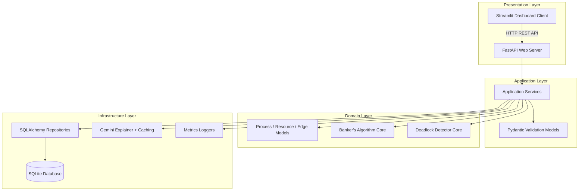

# DeadlockAI Enterprise - AI-Powered Deadlock Detection and Avoidance Lab

DeadlockAI has been upgraded to a production-ready, enterprise-grade architecture. It splits the codebase into distinct Domain, Application, Infrastructure, and Presentation layers, backed by a FastAPI REST API, a highly responsive Streamlit dashboard client, SQLite storage with SQLAlchemy ORM, and database schema versioning via Alembic.

---

## 🏗️ System Architecture



### Clean Architecture Layers
1. **Domain Layer (`src/domain/`)**: Pure business logic (Process, Resource, RAG Edge models) and execution engines (Banker's safety solver, directed cycle detector). Free from external frameworks.
2. **Application Layer (`src/application/`)**: Service orchestrators (`SimulationService`, `AIExplainerService`, `ReportService`, `MetricsService`) and Pydantic validation DTOs.
3. **Infrastructure Layer (`src/infrastructure/`)**: External interfaces. Handles Pydantic Settings, database pool initialization, declarative repository mapping, custom file/console logging, and DI container setup.
4. **Presentation Layer (`src/presentation/`)**:
   - **FastAPI Backend REST API**: Exposes async routes, globally logs exceptions, and records request latency and token metrics in database.
   - **Streamlit Web Dashboard**: Consumes the API using HTTPLink, renders animated metrics cards, handles interactive simulation forms, plots metrics charts, and displays tails of system runtime logs.

---

## 📁 Repository Structure

```text
DeadlockAI/
├── src/
│   ├── domain/
│   │   ├── models/            # Process, Resource, Edge, Banker, Deadlock
│   │   └── repositories/      # Repository interfaces (abstract)
│   ├── application/
│   │   ├── dtos/              # Pydantic validation models
│   │   └── services/          # Simulation, Banker, AI explainer, PDF report, metrics
│   ├── infrastructure/
│   │   ├── config.py          # Pydantic Settings
│   │   ├── database/          # SQLAlchemy session and repository implementations
│   │   ├── logging/           # Console and file logger configs
│   │   └── di/                # Dependency Injection container
│   └── presentation/
│       ├── api/               # FastAPI backend (main, routes, middlewares)
│       └── web/               # Streamlit dashboard client (dashboard, style.css)
├── tests/                     # Unit and integration test suite
├── alembic/                   # Database migrations scripts
├── alembic.ini                # Alembic configuration file
├── Dockerfile                 # Multi-use Docker file
├── docker-compose.yml         # Container orchestration
├── requirements.txt           # Production and dev dependencies
├── README.md                  # System documentation
└── app.py                     # Backwards-compatible Streamlit bootstrapper
```

---

## ⚙️ Setup and Installation

### 1. Configure the Environment
Create a `.env` file in the root directory:
```env
DATABASE_URL=sqlite:///./deadlock.db
GEMINI_API_KEY=your_gemini_api_key_here
GEMINI_MODEL=gemini-2.5-flash
API_HOST=127.0.0.1
API_PORT=8000
```
*Note: If `GEMINI_API_KEY` is omitted, the application will transparently fall back to local rule-based structured explanations.*

### 2. Native System Installation
Create a virtual environment and install dependencies:
```powershell
python -m venv .venv
.\.venv\Scripts\Activate.ps1
pip install -r requirements.txt
```

### 3. Initialize the Database
Apply all Alembic database schema migrations:
```powershell
python -m alembic upgrade head
```

---

## 🚀 Running the Application

### Option A: Local Processes (Recommended for Development)
Start the FastAPI backend server:
```powershell
python -m uvicorn src.presentation.api.main:app --reload --host 127.0.0.1 --port 8000
```
In a separate terminal, launch the Streamlit dashboard:
```powershell
streamlit run app.py
```

### Option B: Docker Compose (One-Click Launch)
Spin up both the FastAPI backend and Streamlit frontend in orchestrated Docker containers:
```powershell
docker-compose up --build
```
- Streamlit Web Dashboard: http://localhost:8501
- Swagger API Docs: http://localhost:8000/docs

---

## 🧪 Verification and Testing

The test suite contains unit tests for bankers safety, deadlock detectors, SQLite database integration, and FastAPI client routing endpoints.

Run the test suite with code coverage:
```powershell
python -m pytest --cov=src tests/
```

---

## 🛡️ API Endpoints Summary

- **Simulation Engine (`/api/simulation`)**:
  - `GET /state`: Retrieve current processes, resources, allocations, active requests, and deadlock cycle nodes.
  - `POST /process` / `DELETE /process/{pid}`: Add or delete processes.
  - `PUT /process/{pid}/state`: Modify process execution status.
  - `POST /resource` / `DELETE /resource/{rid}`: Manage resource metadata.
  - `POST /allocate`: Form allocation edge (Resource ➔ Process).
  - `POST /request`: Form request edge (Process ➔ Resource).
  - `POST /release`: Release allocation edge.
  - `POST /reset`: Flush simulation database.
- **Banker's Safety (`/api/bankers`)**:
  - `POST /evaluate`: Solve Bankers allocation matrix and return Need matrix, Work tracing, and Safe execution sequence.
- **Cognitive AI & PDF (`/api/ai`)**:
  - `POST /explain`: Request Pydantic-structured Gemini explanation.
  - `POST /report`: Download custom ReportLab PDF document containing full active state matrices and AI analysis.
- **Monitoring & Logger (`/api/metrics`)**:
  - `GET /`: Retrieve request latencies, token usage counters, and tracked exceptions.
  - `GET /logs`: Fetch the trailing lines of the application log file `logs/app.log`.